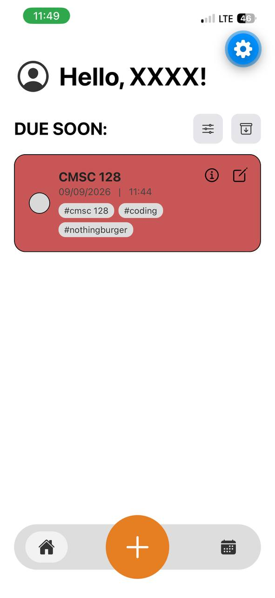
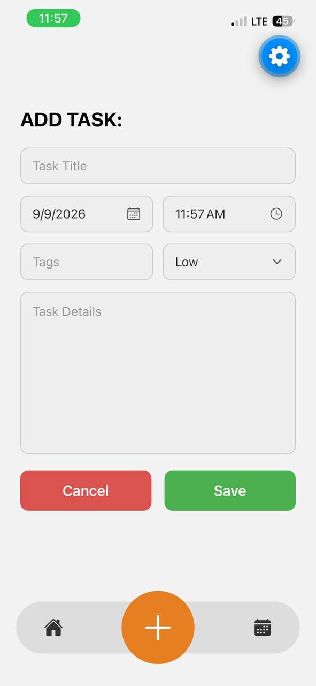
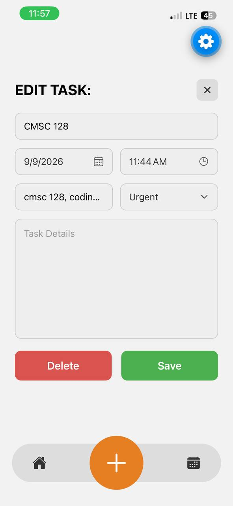
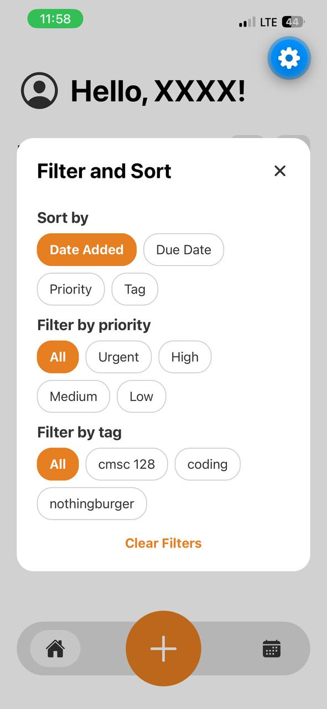
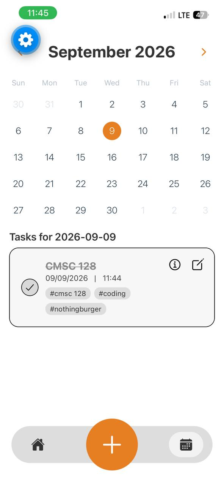
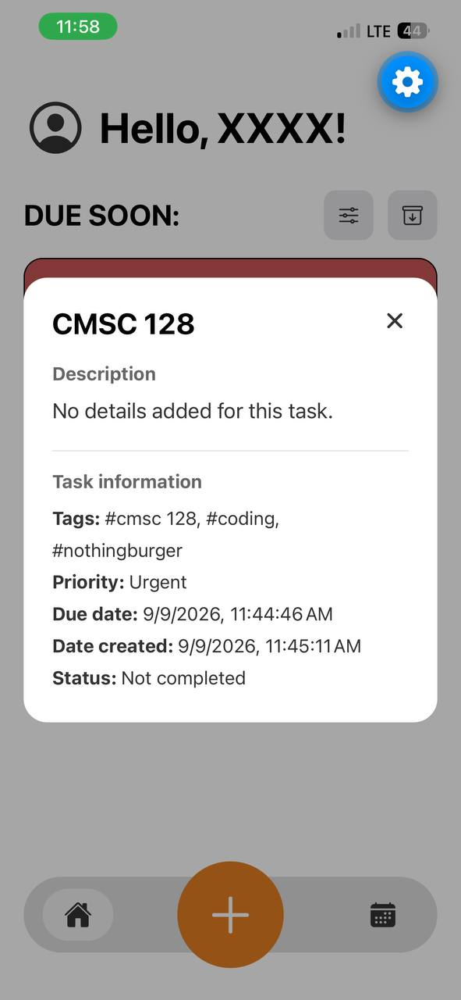
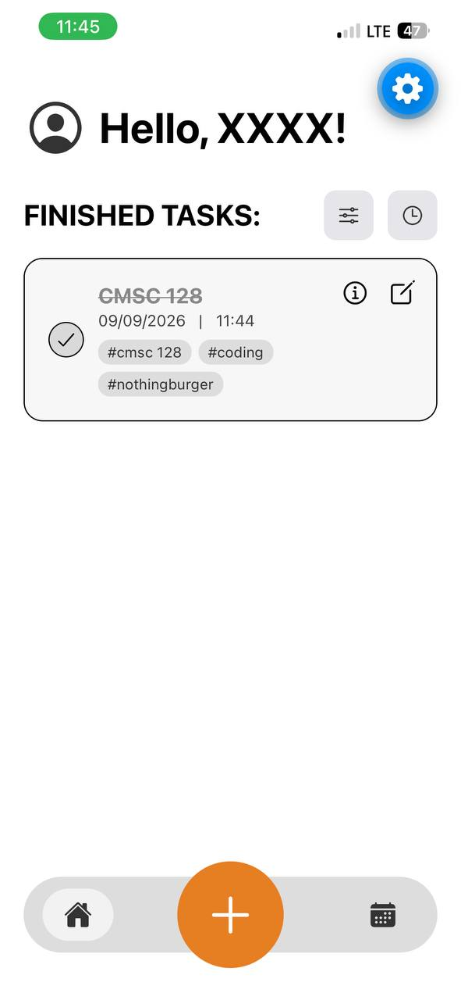

# Task Manager

A cross-platform task management app built for CMSC 128. The app allows users to create, view, update, complete, filter, and delete tasks.

## Tech stack

- **Frontend/UI library:** React Native (React) with Expo SDK 57
- **Navigation:** Expo Router
- **Backend/database:** Firebase Cloud Firestore
- **Programming language:** JavaScript
- **Icons:** Expo Vector Icons (Ionicons)

### Why this stack?

React Native and Expo allow the app to run on Android, iOS, and the web from one codebase. Expo also provides a simple development workflow and built-in support for common React Native features.

Cloud Firestore was chosen because it provides a hosted NoSQL database with a straightforward JavaScript SDK. It works well for task records, supports real-time-ready document operations, and avoids requiring a separate backend server for this project.

## Features

- Create tasks with a title, details, due date/time, priority, and tags
- View tasks due today
- View finished tasks
- Mark tasks as complete or incomplete
- Edit task information
- Filter tasks by priority and tags
- Sort tasks by date, priority, or tag
- Delete tasks with a temporary **Undo** action
- View detailed task information
- View task dates in the calendar

## Prerequisites

Install the following before running the project:

- Node.js and npm
- Expo-compatible device or emulator, or a web browser
- A Firebase project with Cloud Firestore enabled

## Local setup

1. Clone the repository and enter the project folder:

   ```bash
   git clone https://github.com/leoleom/cmsc128-Lab1_CRUD_blancaflor.git
   cd cmsc128-Lab1_CRUD_blancaflor
   ```

2. Install dependencies:

   ```bash
   npm install
   ```

3. Create a `.env` file in the project root. Add the Firebase web app configuration:

   ```env
   EXPO_PUBLIC_FIREBASE_API_KEY=your_api_key
   EXPO_PUBLIC_FIREBASE_AUTH_DOMAIN=your_project.firebaseapp.com
   EXPO_PUBLIC_FIREBASE_PROJECT_ID=your_project_id
   EXPO_PUBLIC_FIREBASE_STORAGE_BUCKET=your_project.firebasestorage.app
   EXPO_PUBLIC_FIREBASE_MESSAGING_SENDER_ID=your_sender_id
   EXPO_PUBLIC_FIREBASE_APP_ID=your_app_id
   ```

4. Make sure Cloud Firestore is enabled in the Firebase console. The app stores task documents in the `tasks` collection.

## Run the app

Start the Expo development server:

```bash
npx expo start
```

Then press `w` for web, `a` for Android, or `i` for iOS in the Expo terminal. You can also start a target directly:

```bash
npx expo start --web
npx expo start --android
npx expo start --ios
```

For Android or iOS, the corresponding emulator or development device must be available.

## Firestore data model

Tasks are stored in the `tasks` collection. A task document has the following shape:

```js
{
  title: "Submit lab report",
  details: "Finish the CRUD documentation",
  dueDate: Timestamp,
  priority: "high",
  tags: ["school", "cmsc128"],
  isDone: false,
  createdAt: Timestamp
}
```

## CRUD and data operations

This app does not expose REST endpoints. CRUD operations are implemented with Firebase Firestore calls in [`backend/services/taskService.js`](./backend/services/taskService.js).

### Create

`createTask(taskData)` adds a document to the `tasks` collection:

```js
await createTask({
  title,
  details,
  dueDate,
  priority,
  tags,
});
```

Internally, this uses Firestore `addDoc(collection(db, "tasks"), newTask)`.

### Read

Read one task by document ID:

```js
const task = await getTaskById(taskId);
```

Read tasks due on a specific date:

```js
const tasks = await getTasksByDate("2026-09-09");
```

Read operations use Firestore `getDoc` and `getDocs` queries.

### Update

Update task fields:

```js
await updateTask(taskId, {
  title,
  details,
  dueDate,
  priority,
  tags,
});
```

Toggle completion:

```js
await toggleTaskComplete(taskId, currentIsDone);
```

These operations use Firestore `updateDoc`.

### Delete

Permanent deletion uses:

```js
await deleteTask(taskId);
```

This calls Firestore `deleteDoc`. The edit screen first returns to the task list and displays an Undo snackbar. If the user does not undo within five seconds, the delete operation is finalized.

## Screenshots

#### Home Screen



#### Add Task Screen



#### Edit Task Screen



### Filter and Sort Controls



### Calendar



### Task Details



### Finished Tasks



