# Task Manager

A cross-platform task management app built for CMSC 128. Users create an account or sign in, then create, view, update, complete, filter, sort, and delete their tasks. Each task is associated with the signed-in Firebase user.

## Tech stack

- **Frontend/UI library:** React Native (React) with Expo SDK 57
- **Navigation:** Expo Router
- **Backend/database:** Firebase client SDK and Cloud Firestore
- **Authentication:** Firebase Authentication with email and password
- **Native session persistence:** Firebase Auth persistence backed by AsyncStorage
- **Programming language:** JavaScript
- **Icons:** Expo Vector Icons (Ionicons)

### Why this stack?

React Native and Expo allow the app to run on Android, iOS, and the web from one codebase. Expo also provides a simple development workflow and built-in support for common React Native features.

Cloud Firestore was chosen because it provides a hosted NoSQL database with a straightforward JavaScript SDK. It works well for task records, supports real-time-ready document operations, and avoids requiring a separate backend server for this project.

Firebase Authentication handles account credentials and auth state. The app uses the Firebase JavaScript SDK directly from the React Native client; it does not expose a custom REST API.

## Features

- Create an account with a display name, email, and password; log in and log out
- Recover a password through a Firebase password-reset email
- Update the profile display name, request an email change with verification, and change the password after reauthentication
- Keep native sign-in state across app launches and route signed-out users to the login screens
- Create tasks with a title, details, due date/time, priority, and tags
- View tasks due today
- View finished tasks
- Mark tasks as complete or incomplete
- Edit task information
- Filter tasks by priority and tags
- Sort tasks by date, priority, or tag
- Delete tasks with a temporary **Undo** action
- View detailed task information
- View task dates in the calendar

## Prerequisites

Install the following before running the project:

- Node.js and npm
- Expo-compatible device or emulator, or a web browser
- A Firebase project with Email/Password Authentication and Cloud Firestore enabled

## Local setup

1. Clone the repository and enter the project folder:

   ```bash
   git clone https://github.com/leoleom/cmsc128-Lab1_CRUD_blancaflor.git
   cd cmsc128-Lab1_CRUD_blancaflor
   ```

2. Install dependencies:

   ```bash
   npm install
   ```

3. Create a `.env` file in the project root. Add the Firebase web app configuration:

   ```env
   EXPO_PUBLIC_FIREBASE_API_KEY=your_api_key
   EXPO_PUBLIC_FIREBASE_AUTH_DOMAIN=your_project.firebaseapp.com
   EXPO_PUBLIC_FIREBASE_PROJECT_ID=your_project_id
   EXPO_PUBLIC_FIREBASE_STORAGE_BUCKET=your_project.firebasestorage.app
   EXPO_PUBLIC_FIREBASE_MESSAGING_SENDER_ID=your_sender_id
   EXPO_PUBLIC_FIREBASE_APP_ID=your_app_id
   ```

4. In the Firebase console, enable **Authentication > Sign-in method > Email/Password** and create a **Cloud Firestore** database. The app stores task documents in the `tasks` collection. No database migration or seed data is required; task documents are created when users add tasks.

5. Configure Firestore Security Rules to authorize access only to the authenticated owner of each task. The app stores the Firebase user's UID in each task's `userId` field and filters task lists by that UID, but client-side filtering is not a security boundary. This repository does not include deployable Firestore rules.

## Run the app

Start the Expo development server:

```bash
npx expo start
```

Then press `w` for web, `a` for Android, or `i` for iOS in the Expo terminal. You can also start a target directly:

```bash
npx expo start --web
npx expo start --android
npx expo start --ios
```

For Android or iOS, the corresponding emulator or development device must be available.

## Authentication and sessions

Authentication is provided by Firebase Authentication's email/password provider. Sign-up creates a Firebase user and sets the user's display name. Login signs in with the email and password. The app listens for Firebase auth-state changes in `AuthContext`; the root layout waits for the initial auth check and then redirects signed-out users to `/login` and signed-in users away from the public login, sign-up, and password-reset screens.

On native platforms, Firebase Auth persistence is initialized with React Native AsyncStorage, so the Firebase session can be restored after restarting the app. On web, the app uses Firebase's standard web Auth initialization. Logging out calls Firebase `signOut` and ends the current session.

Password recovery is email-based: the user enters their email on **Forgot Password**, and Firebase sends a password-reset link using `sendPasswordResetEmail`. The app does not store or handle password-reset tokens itself. The profile screen also supports changing a password after reauthentication with the current password, and requesting an email change after reauthentication; Firebase sends a verification link, and the email is not changed until it is confirmed.

The authentication service in [`backend/services/authService.js`](./backend/services/authService.js) exposes these equivalent operations (there are no HTTP endpoints):

```js
await registerUser({ email, password, displayName });
await loginUser({ email, password });
await requestPasswordReset(email);
await changeUserPassword({ currentPassword, newPassword });
await requestEmailChange({ currentPassword, newEmail });
await logoutUser();
```

## Firestore data model

Tasks are stored in the `tasks` collection. A task document has the following shape:

```js
{
  userId: "firebase-auth-uid",
  title: "Submit lab report",
  details: "Finish the CRUD documentation",
  dueDate: Timestamp,
  priority: "high",
  tags: ["school", "cmsc128"],
  isDone: false,
  createdAt: Timestamp
}
```

## CRUD and data operations

This app does not expose REST endpoints. CRUD operations are implemented with Firebase Firestore calls in [`backend/services/taskService.js`](./backend/services/taskService.js).

### Create

`createTask(taskData)` adds a document to the `tasks` collection:

```js
await createTask({
  title,
  details,
  dueDate,
  priority,
  tags,
});
```

Internally, this uses Firestore `addDoc(collection(db, "tasks"), newTask)`.

### Read

Read one task by document ID:

```js
const task = await getTaskById(taskId);
```

Read tasks due on a specific date:

```js
const tasks = await getTasksByDate("2026-09-09");
```

Read operations use Firestore `getDoc` and `getDocs` queries.

### Update

Update task fields:

```js
await updateTask(taskId, {
  title,
  details,
  dueDate,
  priority,
  tags,
});
```

Toggle completion:

```js
await toggleTaskComplete(taskId, currentIsDone);
```

These operations use Firestore `updateDoc`.

### Delete

Permanent deletion uses:

```js
await deleteTask(taskId);
```

This calls Firestore `deleteDoc`. The edit screen first returns to the task list and displays an Undo snackbar. If the user does not undo within five seconds, the delete operation is finalized.

## Screenshots

#### Login Screen

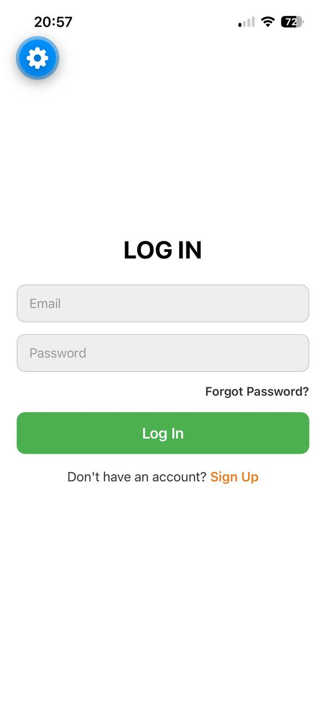

#### Sign Up Screen

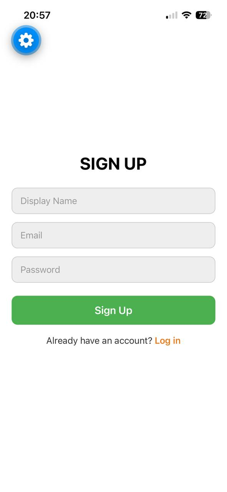

#### Forgot Password Screen

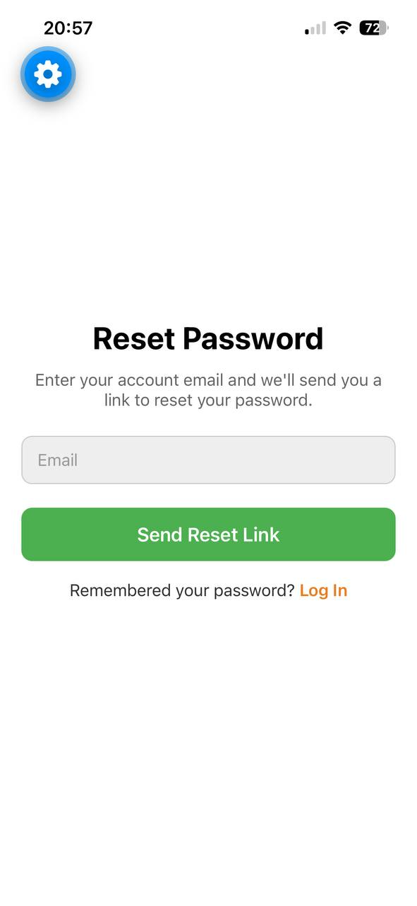

#### Home Screen

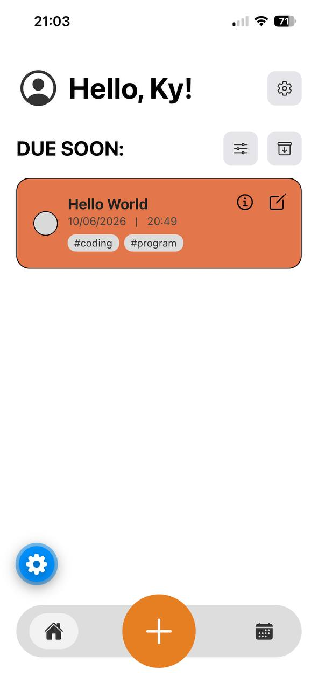

#### Profile Screen


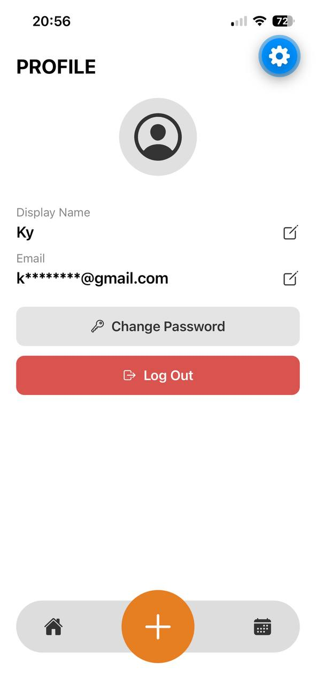

#### Add Task Screen

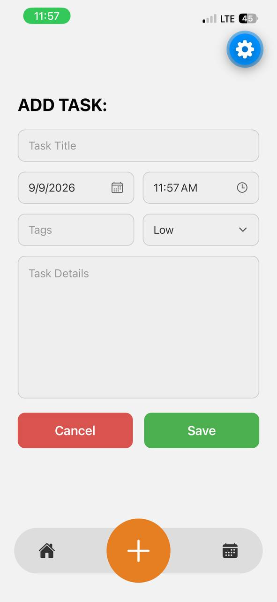

#### Edit Task Screen

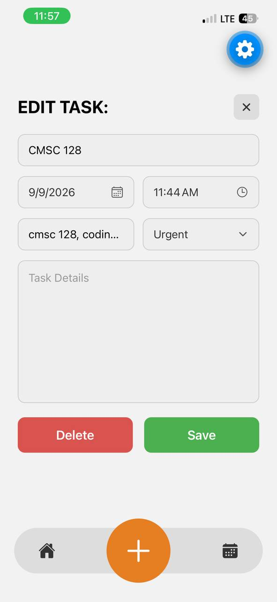

### Filter and Sort Controls

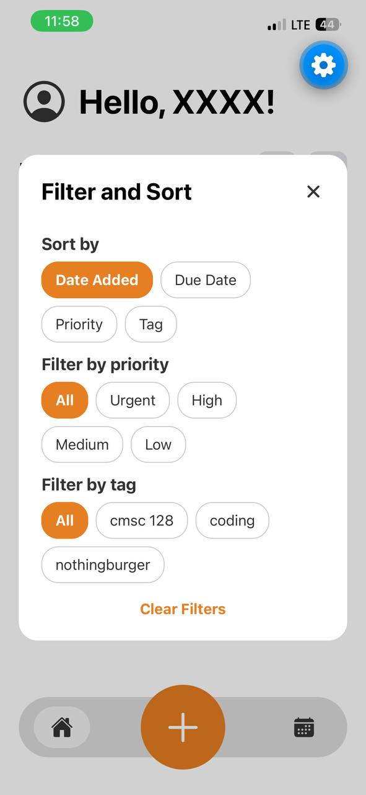

### Calendar

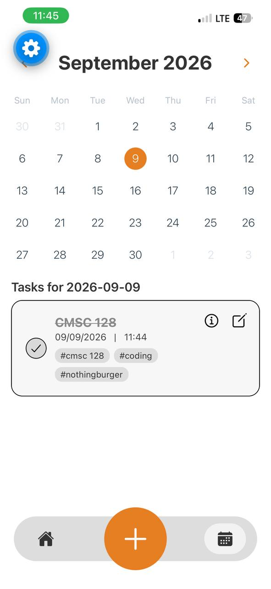

### Task Details

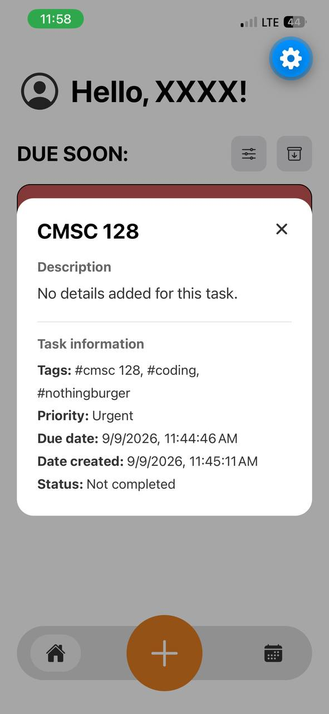

### Finished Tasks

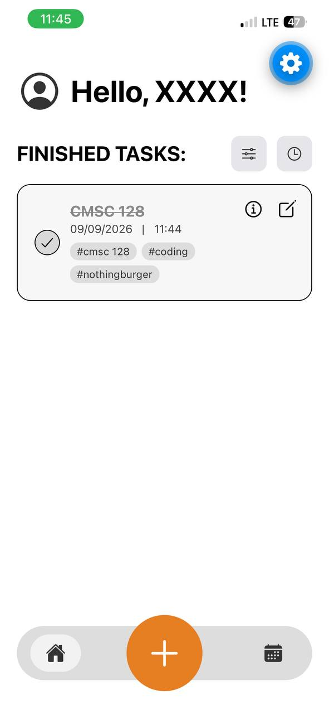

